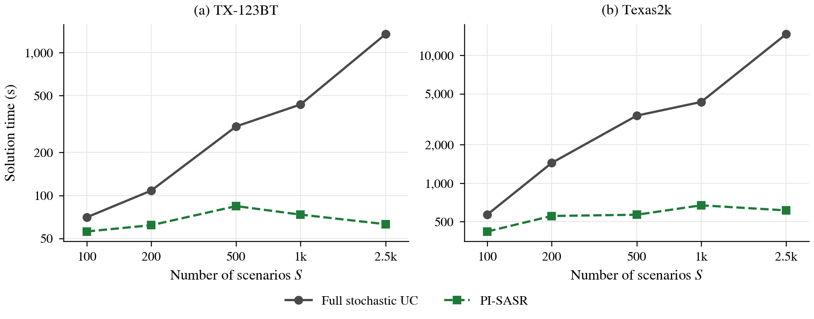
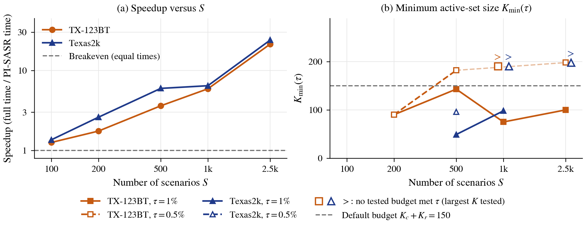
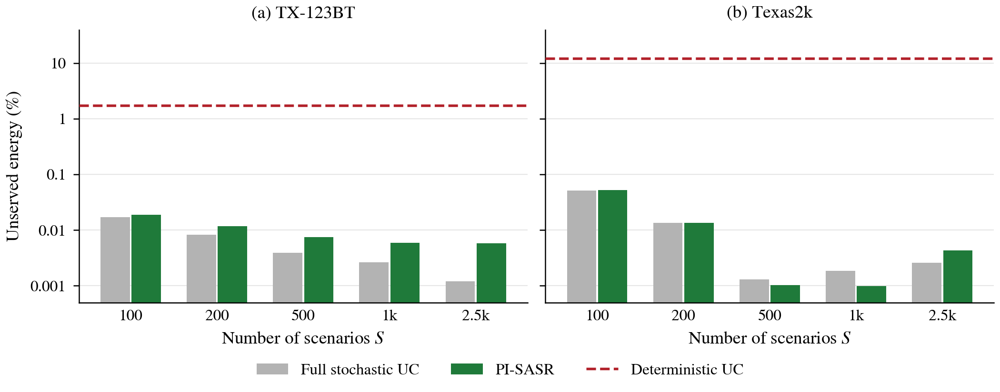

# PI-SASR: Physics-Informed Surrogate-Assisted Scenario Reduction for Two-Stage Stochastic Unit Commitment

[](LICENSE)
[](environment.yml)

This repository contains the source code, processed input data, numerical results and
reproduction scripts of the paper *Physics-Informed Surrogate-Assisted Scenario Reduction for
Scalable Two-Stage Stochastic Unit Commitment: A Cross-System Validation on Synthetic Texas Grids*
(HICSS-60, to appear). Two-stage stochastic unit commitment (UC) replicates the recourse
dispatch once for each scenario, so its solution time grows quickly with the number of scenarios
S. PI-SASR learns *scenario criticality*, the recourse cost a scenario induces under a reference
commitment, with a Gaussian-process (GP) surrogate whose inputs are inexpensive physics-informed
adequacy and ramp features and a low-rank temporal embedding. It solves a reduced UC over an
active set of critical and coverage scenarios whose size does not depend on S, with a baseload
pre-commitment;
a merit-order verification over all S scenarios gives an under-representation statistic that
decides whether the active set is enriched, and a statistical lower bound gives a certified
optimality gap. On two fleets derived from the synthetic TX-123BT (138 committable units) and
Texas2k Series25 (568 units) Texas grids, with N-1 generator outages and disjoint training and
evaluation scenario sets, the benchmark gap against the full (extensive-form) model stays within
0.83% and 1.29% at every tested S, the speedup grows with S to 21.3 and 24.0 times at S = 2,500,
and the reduced commitments keep the full model's resilience to generator outages on the
evaluation set.

## Contents

1. [Citation](#citation)
2. [Key results](#key-results)
3. [Method overview](#method-overview)
4. [Repository structure](#repository-structure)
5. [Requirements and installation](#requirements-and-installation)
6. [Quick start](#quick-start)
7. [Full reproduction guide](#full-reproduction-guide)
8. [Data](#data)
9. [Reproducibility notes](#reproducibility-notes)
10. [Section 7.2 of the paper](#section-72-of-the-paper)
11. [License](#license)
12. [Contact](#contact)

## Citation

If you use this code, data or results, please cite the paper:

```bibtex
@inproceedings{korkali2027pisasr,
  author    = {Korkali, Mert and Andriniaina, Davida},
  title     = {Physics-Informed Surrogate-Assisted Scenario Reduction for Scalable
               Two-Stage Stochastic Unit Commitment: A Cross-System Validation on
               Synthetic {Texas} Grids},
  booktitle = {Proceedings of the 60th Hawaii International Conference on System
               Sciences (HICSS-60)},
  year      = {2027},
  month     = jan,
  note      = {To appear}
}
```

[`CITATION.cff`](CITATION.cff) holds the same information in machine-readable form. If you use the
processed data, please also cite the sources of the test systems listed in
[`LICENSE-DATA.md`](LICENSE-DATA.md).

## Key results

PI-SASR against the full two-stage stochastic UC over S training scenarios (Table 3 of the paper;
`results/<system>/summary/scaling.csv`). The benchmark gap is the excess of the exact expected
cost of the PI-SASR commitment over the full model's objective (0.1% MILP tolerance); K is the
active-set size.

| System | S | Full model time (s) | PI-SASR time (s) | Speedup | Benchmark gap (%) | K |
|---|---:|---:|---:|---:|---:|---:|
| TX-123BT (138 units) | 1,000 | 434 | 74 | 5.9 | 0.69 | 148 |
| TX-123BT (138 units) | 2,500 | 1,347 | 63 | 21.3 | 0.83 | 146 |
| Texas2k Series25 (568 units) | 1,000 | 4,324 | 671 | 6.4 | 0.71 | 146 |
| Texas2k Series25 (568 units) | 2,500 | 14,689 | 613 | 24.0 | 1.29 | 147 |

Times are wall-clock times on one Apple M2 Ultra workstation (24 CPU cores, 192 GB). Full-model times are
the solver call only on TX-123BT and include model construction on Texas2k (and writing the model
file at S = 2,500), so the TX-123BT speedups are conservative; the PI-SASR time runs from data
loading to the end of the merit-order verification (see [`docs/REPRODUCIBILITY.md`](docs/REPRODUCIBILITY.md)).
On the 2,000 evaluation scenarios at S = 1,000, the unserved-energy rate under generator outages
is 0.0060% for PI-SASR, 0.0026% for the full model and 1.755% for the deterministic UC on
TX-123BT, and 0.0010%, 0.0019% and 12.13% on Texas2k.



*Figure 2. Solution time versus the number of scenarios S (log-log): the full model's time climbs
steeply with S, whereas PI-SASR's stays nearly flat.*



*Figure 3. (a) Speedup of PI-SASR over the full model; (b) smallest active-set size whose
benchmark gap meets a tolerance of 1% or 0.5%. A hollow marker with ">" means that no tested
budget met the tolerance; the value shown is the largest active set tested.*



*Figure 4. Evaluation-set unserved-energy rate under generator outages (log scale): PI-SASR
tracks the full model, and both lie about two to four orders of magnitude below the deterministic UC.*

All four tables, the three figures and a list of every number quoted in the results of the paper
are in [`paper_assets/`](paper_assets/README.md); [`paper_assets/numbers.md`](paper_assets/numbers.md)
compares each of the 419 numbers with the value computed from `results/` (all agree).

## Method overview

The steps below refer to one test system and one scenario count S. Default settings, identical on
both systems: K_c = 90 critical scenarios, K_r = 60 coverage scenarios, a design set of 140
scenarios, embedding rank r = 5, enrichment tolerance epsilon = 0.2% and an enrichment budget of
one round (40 scenarios).

**Before the run**

1. *Reference commitment.* The deterministic (expected-value) UC is solved once; its schedule
   u_ref is stored in `results/<system>/runs/deterministic/commitment.csv`.

**Learning scenario criticality and forming the active set** (the offline steps of Figure 1 of
the paper)

2. *Features.* For each of the S scenarios, 13 physics-informed adequacy and ramp features of the
   24-hour net-load profile and its rank-5 SVD embedding (`pisasr.features`).
3. *GP surrogate.* The recourse cost under u_ref of a random design set of 140 scenarios is
   computed with the merit-order dispatch, and a GP with an anisotropic Matérn-5/2 kernel is
   fitted to it (`pisasr.surrogate`); a quarter of the design set is kept aside once to measure
   its coefficient of determination.
4. *Active set.* The 90 scenarios with the largest predicted recourse (critical scenarios) and
   the 60 k-means medoids of the embedding (coverage scenarios), at most 150 scenarios.
5. *Baseload pre-commitment.* Units on in every hour of u_ref are fixed on.

**Reduced UC and verification** (the online steps of Figure 1)

6. *Reduced UC.* The two-stage UC over the active set with equal weights (Gurobi, 0.1% MILP
   tolerance).
7. *Merit-order verification.* The commitment is evaluated with the ramp-free merit-order
   dispatch over all S scenarios. If the under-representation statistic (verified cost relative
   to the reduced objective) exceeds epsilon, the 40 scenarios with the largest verified recourse
   are added and step 6 is repeated once.

The PI-SASR time reported in the paper (the online time of Table 4) runs from data loading to the
end of the merit-order verification, so it includes the offline steps 2 to 5 as well as steps 6
and 7.

**After the run** (not included in the PI-SASR time)

8. *Exact objective.* The commitment is re-evaluated with the exact ramp-coupled LP over the S
   scenarios, which gives the benchmark gap against the full model.

The functions are `pisasr.pisasr.select_active_set` (steps 2 to 5) and `pisasr.pisasr.run_pisasr`
(steps 6 to 8). [`docs/MODEL.md`](docs/MODEL.md) states the UC model, the evaluation LP, the
merit-order dispatch and every step exactly as implemented, and lists the differences from the
compact formulation printed in the paper.

## Repository structure

```text
PI-SASR/
├── src/pisasr/                   Python package
│   ├── uc_model.py               UC model: deterministic, full (extensive-form) and reduced UC
│   ├── evaluation.py             exact ramp-coupled LP evaluation of a fixed commitment
│   ├── outages.py                reproducible N-1 generator-outage draw for each scenario
│   ├── features.py               physics-informed features and low-rank embedding
│   ├── surrogate.py              Gaussian-process (GP) criticality surrogate
│   ├── merit_order.py            merit-order recourse and its comparison with the LP
│   ├── pisasr.py                 the PI-SASR algorithm
│   ├── baselines.py              deterministic UC and full model (in memory or through an LP file)
│   ├── experiments.py            additional experiments (Sections 4, 6 and 7.3, Table 4)
│   ├── statistics.py             paired confidence intervals, lower bound and certified gap
│   ├── reporting.py              evaluation summaries, tables and figures from the CSV files
│   ├── systems.py                the two test systems and the selection of one of them
│   ├── constants.py              shared constants and Gurobi options
│   └── paths.py                  repository folders and data checksums
├── scripts/                      command-line programs (all accept --help)
│   ├── data/                     download_tx123bt.py, prepare_tx123bt.py, prepare_texas2k.py
│   ├── run_full_model.py         deterministic UC and full model
│   ├── run_pisasr.py             PI-SASR
│   ├── evaluate.py               evaluation-set LP of commitments
│   ├── run_experiments.py        additional experiments, one at a time
│   ├── run_replication.py        five random draws of the design set (Section 6.2)
│   ├── validate_merit_order.py   accuracy of the merit-order dispatch (Section 6.5)
│   ├── summarize_evaluation.py   evaluation summaries
│   ├── paired_cost_difference.py paired confidence intervals (Section 6.3)
│   └── make_paper_assets.py      tables, figures and numbers of the paper
├── data/                         processed inputs (see data/README.md)
│   ├── tx123bt/                  138-unit portfolio, training and test scenarios, copula parameters
│   ├── texas2k/                  568-unit portfolio, training and test scenarios
│   └── SHA256SUMS                checksums of the 14 data files
├── results/                      reference results of the paper (see docs/RESULTS_GUIDE.md)
│   └── tx123bt/, texas2k/        runs/ (commitments, solver metrics, evaluations),
│                                 summary/ and experiments/ (CSV files)
├── paper_assets/                 tables (LaTeX, Markdown), figures (PDF, PNG), numbers.md
├── docs/
│   ├── MODEL.md                  formulation and algorithm as implemented
│   ├── REPRODUCIBILITY.md        determinism, timing definitions, run times, platform notes
│   └── RESULTS_GUIDE.md          file, column and command behind every table, figure and number
├── tests/                        pytest suite (markers: gurobi, slow)
├── Makefile                      the commands of this README grouped into targets
├── environment.yml               conda environment with the package versions of the paper
├── requirements.txt              the same versions for pip
├── pyproject.toml                package metadata
├── CITATION.cff, LICENSE, LICENSE-DATA.md
└── outputs/                      destination of every rerun (created on first use; not tracked)
```

Every script that solves or evaluates a model writes to `outputs/<system>/` (or to the folder
given by the environment variable `PISASR_OUTPUT_DIR`, or by `--output-dir`), with the same folder
names as `results/`. By default these scripts never write to `results/`; they do so only when
`--output-dir results` is given, as for the stored merit-order file of TX-123BT
([`docs/RESULTS_GUIDE.md`](docs/RESULTS_GUIDE.md), Section 5). The scripts that only summarize results
(`summarize_evaluation.py`, `paired_cost_difference.py` and `make_paper_assets.py`) read
`results/` by default and rewrite `results/<system>/summary/` and `paper_assets/` in place, with
identical content as long as `results/` is unchanged; give them `--check`, `--results-dir outputs`
or `--out <folder>` to leave the stored files untouched.

## Requirements and installation

* Python 3.11 with NumPy, pandas, SciPy, scikit-learn, Pyomo, gurobipy, matplotlib and openpyxl
  (versions in [`environment.yml`](environment.yml) and [`requirements.txt`](requirements.txt)).
* Gurobi with a valid license for every MILP and LP. Gurobi offers free academic licenses
  (<https://www.gurobi.com/academia/academic-program-and-licenses/>). The size-limited license
  that comes with the `gurobipy` package is too small even for the short end-to-end check of
  Level 2 below. Regenerating the tables and figures (quick start, Level 1) and the fast tests
  need no Gurobi license.
* Tested platform: macOS 26.6 on an Apple M2 Ultra (24 CPU cores, 192 GB of memory), Python
  3.11.15 (conda-forge), NumPy 2.4.6, pandas 3.0.3, SciPy 1.17.1, scikit-learn 1.9.0, Pyomo
  6.10.0, gurobipy 13.0.2, matplotlib 3.10.9, openpyxl 3.1.5 and pytest 7.2.2. The results of the
  paper were computed on this workstation with the same versions of Gurobi, Pyomo and
  scikit-learn. Other platforms have not been tested.

With conda (recommended; the environment installs the package in editable mode):

```bash
git clone https://github.com/mertkorkali/PI-SASR.git
```

```bash
cd PI-SASR
```

```bash
conda env create -f environment.yml
```

```bash
conda activate pisasr
```

With pip, in an existing Python 3.11 environment:

```bash
python -m pip install -r requirements.txt
```

```bash
python -m pip install -e .
```

The package must be installed in editable mode (`-e`), because it locates `data/` and `results/`
relative to its source folder; after a regular installation the scripts do not find them (the
solver scripts stop with an error that says so).

Check that Gurobi and its license work. The command solves a model with 2,001 variables, one more
than the size-limited license accepts, and prints the Gurobi version:

```bash
python -c "import gurobipy as gp; m = gp.Model(); m.Params.OutputFlag = 0; m.addVars(2001); m.optimize(); print('Gurobi', gp.gurobi.version(), 'license OK')"
```

Under the size-limited license it prints "Restricted license - for non-production use only" and
stops with the error "Model too large for size-limited license"; the tests that need Gurobi are
then skipped.

All commands below are run from the repository root. The [`Makefile`](Makefile) groups them into
targets; `make help` lists the targets, and the variables `PYTHON` and `OUT` can be set on the
command line (for example `make test-fast PYTHON=python3`).

## Quick start

The times below were measured on the reference machine.

### Level 1: regenerate every table and figure from the included results (seconds, no solver)

```bash
python scripts/summarize_evaluation.py --check
```

```bash
python scripts/paired_cost_difference.py --check
```

```bash
python scripts/make_paper_assets.py --strict
```

The first two commands recompute the evaluation summaries and the paired confidence intervals of
Section 6.3 from the 22 `evaluation.csv` files and compare them with the stored summaries (about
1 s each; they print "identical within 1e-9"). The third rewrites `paper_assets/` (Tables 1 to
4, Figures 2 to 4 and `numbers.md`) in about 2 s and prints
`419 numbers checked: 419 agree, 0 differ, 0 not yet generated`; the rewritten files are
byte-identical to the committed ones. To write them elsewhere, add `--out <folder>`.

### Level 2: fast tests and a short end-to-end check (about 1.5 min)

```bash
python -m pytest -m "not gurobi and not slow"
```

```bash
python scripts/run_full_model.py --system tx123bt --S 20
```

```bash
python scripts/run_pisasr.py --system tx123bt --S 20
```

The fast tests (69 tests, about 40 s) check the data checksums, the outage draws, the PI-SASR
selection at S = 1,000 against the reference values (K = 148, GP coefficient of determination
0.5112988860331589), the merit-order verification, the statistics, the command-line scripts and
the code that builds the tables and figures. The two scripts solve the full model at S = 20 and
run PI-SASR at S = 20; PI-SASR prints `K=20, baseload units=64, ..., benchmark gap=-0.04198%`.
In a rerun on the reference machine the two steps took about 18 s each, and the full model's
objective was 38,028,161.01. At S = 20 the active set contains all 20 scenarios, so this check
covers every step of the method except the reduction. PI-SASR also prints `GP R^2=-0.9206`: at
S = 20 the design set consists of the 20 scenarios themselves, of which only 10 are kept aside for
validation, so the GP coefficient of determination is not meaningful and is negative; the run has
not failed. `python -m pytest -m "not slow"` runs the fast tests together with the 18 tests that
need Gurobi (87 tests, about 4 min), and `python -m pytest` runs all 95 tests, including 8 slow
evaluations of Texas2k commitments (about 6 min in total). Without a license that allows models of
this size, the tests that need Gurobi are skipped.

### Level 3: reproduce a principal result (about 4 min)

PI-SASR on TX-123BT at S = 1,000 (Table 2 and Table 3 of the paper):

```bash
python scripts/run_pisasr.py --system tx123bt --S 1000
```

On the reference machine it prints (the times vary from run to run)

```text
PI-SASR S=1000: K=148, baseload units=64, GP R^2=0.5113, objective=38,369,890.51, benchmark gap=+0.68715%, solution time=75.1 s (exact recomputation 170.7 s; wall 245.7 s)
```

The reference values are in `results/tx123bt/runs/pisasr_S1000/solve_metrics.csv`: objective
38,369,890.506773256, benchmark gap 0.6871504335848581%, K = 148, GP coefficient of determination
0.5112988860331589 and a solution time of 73.6 s. All values except the times agree to the last
digit, and the commitment is identical (no output means that the two files are identical):

```bash
diff outputs/tx123bt/runs/pisasr_S1000/commitment.csv results/tx123bt/runs/pisasr_S1000/commitment.csv
```

Optionally, evaluate the new commitment on the 2,000 evaluation scenarios (about 6 min; it prints
the largest relative difference from the stored `evaluation.csv`, 0.00e+00 on the reference
machine):

```bash
python scripts/evaluate.py --system tx123bt --runs pisasr_S1000
```

PI-SASR reads the stored reference commitment `results/<system>/runs/deterministic/commitment.csv`
and, for the benchmark gap, the stored full-model objective (a full-model rerun in `outputs/` is
used instead when it exists; the script prints which one it uses).

## Full reproduction guide

A complete rerun takes about 1.5 days on the reference machine if the steps run one after another
(about 8 h for TX-123BT and 28 h for Texas2k). Every script that solves a model skips
results that already exist in its output folder, so an interrupted run can be resumed; `--force`
computes them again. The Texas2k full models need a workstation with a large memory: on the
reference machine (192 GB) the model at S = 2,500 did not fit as a Pyomo model and is therefore
solved from a model file; the peak memory of the runs was not recorded.

### Paper item to command

In the commands, `<system>` is `tx123bt` or `texas2k`; output paths are relative to
`outputs/<system>/`. Times are for the reference machine, as recorded in the `solve_metrics.csv`
files and the time columns of the experiment files; most experiment times were recorded while
other experiments shared the machine (see [`docs/REPRODUCIBILITY.md`](docs/REPRODUCIBILITY.md),
Section 4).
[`docs/RESULTS_GUIDE.md`](docs/RESULTS_GUIDE.md) names the columns behind every number.

| Paper item | Command | Output | Time: TX-123BT / Texas2k |
|---|---|---|---|
| Table 1, Section 5.1 (test systems) | none: computed from `data/` by `make_paper_assets.py` | `paper_assets/tables/table1_systems.*` | seconds |
| Table 2 (S = 1,000) | `run_full_model.py --system <system> --deterministic --S 1000`, `run_pisasr.py --system <system> --S 1000`, `evaluate.py --system <system> --runs deterministic full_S1000 pisasr_S1000` | `runs/deterministic/`, `runs/full_S1000/`, `runs/pisasr_S1000/` | 1 s + 7 min + 4 min + 17 min / 4 s + 72 min + 23 min + 75 min |
| Table 3, Figures 2 and 3(a), Section 6.1 | `run_full_model.py --system <system> --S 100 200 500 1000 2500`, `run_pisasr.py --system <system> --S 100 200 500 1000 2500` | `runs/full_S<S>/`, `runs/pisasr_S<S>/` | 40 min + 18 min / 6.8 h + 1.7 h |
| Figure 3(b), Section 6.2 (active-set budget) | `run_experiments.py --system <system> --stage budget-sensitivity` | `experiments/budget_sensitivity.csv` | 1.9 h / 6.2 h |
| Figure 4, Section 6.3 (evaluation set) | `evaluate.py --system <system> --runs all`, then `summarize_evaluation.py --results-dir outputs` and `paired_cost_difference.py --results-dir outputs` | `runs/*/evaluation.csv`, `summary/evaluation_metrics.csv`, `summary/paired_cost_difference_S1000.csv` | 11 × 6 min / 11 × 25 min |
| Table 4, Section 7.3 (component analysis) | `run_experiments.py --system tx123bt --stage component-timing` | `experiments/component_timing_S1000.csv` | 40 min / not in the paper |
| Section 7.3 (criticality-only selection) | `run_experiments.py --system <system> --stage criticality-only` | `experiments/criticality_only_S1000.csv` | 1 h / 3 h |
| Section 4.1 (embedding) | `run_experiments.py --system <system> --stage embedding` | `experiments/embedding_spectrum_S1000.csv`, `experiments/embedding_space_S1000.csv` (TX-123BT) | 17 min / 2 s |
| Section 4.2, Section 6.1 (GP kernels) | `run_experiments.py --system <system> --stage gp-kernels` | `experiments/gp_kernels_S1000.csv` | 2 min / 3 min |
| Sections 4.4 and 6.1 (lower bound, certified gap) | `run_experiments.py --system <system> --stage lower-bound` | `experiments/lower_bound_batches.csv`, `experiments/certified_gap.csv` | 37 min (S' = 200 and 500) / 2 h |
| Section 6.2 (five design-set draws) | `run_replication.py` | `experiments/design_set_replication_S1000.csv` | 50 min / not in the paper |
| Section 6.2 (weighting at S = 2,500) | `run_experiments.py --system <system> --stage weights-s2500` | `experiments/scenario_weights_S2500.csv` | 16 min / 1.4 h |
| Section 6.4 (scenario weights) | `run_experiments.py --system <system> --stage scenario-weights` | `experiments/scenario_weights_S1000.csv` | 30 min / 2.4 h |
| Section 6.5 (merit-order accuracy) | `validate_merit_order.py --system <system>` | `summary/merit_order_validation.csv` | 12 s / 46 s |
| All tables, figures and numbers | `make_paper_assets.py --results-dir outputs --out outputs/paper_assets` | `outputs/paper_assets/` | 2 s |

Without `--S`, `run_experiments.py` uses the scenario counts of the paper. The certified gaps can
also be recomputed in a few seconds from the stored batch incumbents, without solving any MILP:
`run_experiments.py --system <system> --stage lower-bound --batches-file results/<system>/experiments/lower_bound_batches.csv`.

### Order of the steps

The steps below are for TX-123BT; repeat them with `--system texas2k` (the paper reports
`run_replication.py` and the `component-timing` experiment for TX-123BT only; both scripts also
accept `--system texas2k` and then print a note).

1. Deterministic UC and full models (the Texas2k full model at S = 2,500 is written to a model file
   of several gigabytes in the system temporary folder and solved from it; `--model-file-dir`
   chooses another folder):

   ```bash
   python scripts/run_full_model.py --system tx123bt --deterministic --S 100 200 500 1000 2500
   ```

2. PI-SASR at every scenario count (after step 1, so that the benchmark gaps use the new
   full-model objectives):

   ```bash
   python scripts/run_pisasr.py --system tx123bt --S 100 200 500 1000 2500
   ```

3. Evaluation of the 11 commitments on the 2,000 evaluation scenarios:

   ```bash
   python scripts/evaluate.py --system tx123bt --runs all
   ```

4. Additional experiments, one experiment at a time (after steps 2 and 3: the lower bound uses
   the evaluation costs of `full_S1000` and `pisasr_S1000`); the values of `--stage` are
   `component-timing` (TX-123BT in the paper), `criticality-only`, `gp-kernels`, `embedding`,
   `scenario-weights`, `weights-s2500`, `lower-bound` and `budget-sensitivity`:

   ```bash
   python scripts/run_experiments.py --system tx123bt --stage budget-sensitivity
   ```

5. Merit-order accuracy check (and, for TX-123BT, the five design-set draws):

   ```bash
   python scripts/validate_merit_order.py --system tx123bt
   ```

   ```bash
   python scripts/run_replication.py
   ```

6. Summaries, tables, figures and numbers from the rerun:

   ```bash
   python scripts/summarize_evaluation.py --results-dir outputs
   ```

   ```bash
   python scripts/paired_cost_difference.py --results-dir outputs
   ```

   ```bash
   python scripts/make_paper_assets.py --results-dir outputs --out outputs/paper_assets
   ```

   `outputs/paper_assets/numbers.md` then compares every number of the paper with the rerun.
   Wall-clock times and the speedups computed from them always differ from those of the paper;
   they are marked `time differs` rather than counted as differences. Objectives of MILPs that
   were solved again from scratch can also differ within the 0.1% MILP tolerance (see
   [Reproducibility notes](#reproducibility-notes)).

By default PI-SASR and the experiments use the stored reference commitment of `results/`, which
makes the rerun comparable with the paper. To use the deterministic UC solved in step 1 instead,
add `--reference outputs` to `run_pisasr.py`, `run_experiments.py`, `run_replication.py` and
`validate_merit_order.py`; the results then differ slightly (see
[Reproducibility notes](#reproducibility-notes)).

## Data

| Folder | Contents | Source | License |
|---|---|---|---|
| `data/tx123bt/` | 138 committable units (natural gas, coal, hydro, nuclear; 76.4 GW), 2,500 training and 5,000 test net-load scenarios, Gaussian-copula parameters | TX-123BT, University of Houston (figshare, version 6) | CC BY 4.0 |
| `data/texas2k/` | 568 committable units (natural gas, coal, nuclear, hydro, diesel, wood; 77.8 GW), 2,500 training and 5,000 test net-load scenarios | Texas2k Series25 "Case 1: 2025 Summer Peak" and the ACTIVSg2000 2016 time series, Texas A&M University | CC BY 4.0 for the authors' contribution; Texas A&M terms for the underlying data |

The evaluation set of each system is the first 2,000 scenarios of its test file. Please cite
the sources of the test systems:

* J. Lu, X. Li, H. Li, T. Chegini, C. Gamarra, Y. C. E. Yang, M. Cook and G. Dillingham, "A
  synthetic Texas power system with time-series weather-dependent spatiotemporal profiles,"
  *Sustainable Energy, Grids and Networks*, vol. 43, art. no. 101774, Sep. 2025,
  doi:10.1016/j.segan.2025.101774; dataset: J. Lu and X. Li, "Texas Synthetic Power System Test
  Case (TX-123BT).zip," figshare, dataset, version 6, 2023, doi:10.6084/m9.figshare.22144616.v6.
* A. B. Birchfield, T. Xu, K. M. Gegner, K. S. Shetye and T. J. Overbye, "Grid structural
  characteristics as validation criteria for synthetic networks," *IEEE Transactions on Power
  Systems*, vol. 32, no. 4, pp. 3258–3265, Jul. 2017, doi:10.1109/TPWRS.2016.2616385.
* H. Li, J. H. Yeo, A. L. Bornsheuer and T. J. Overbye, "The creation and validation of load time
  series for synthetic electric power systems," *IEEE Transactions on Power Systems*, vol. 36,
  no. 2, pp. 961–969, Mar. 2021, doi:10.1109/TPWRS.2020.3018936.
* Texas A&M University Electric Grid Test Case Repository, "Texas2k Series25 case," 2025,
  <https://electricgrids.engr.tamu.edu/texas2k-series25/>.

Neither raw source is included; the TX-123BT archive (CC BY 4.0) is large (544 MB) and is fetched
by a script, and the raw Texas A&M files have no license for redistribution. The processed files
can be rebuilt from the raw sources, and the rebuilt files are compared with `data/SHA256SUMS`
(on the reference machine they are byte-identical):

```bash
python scripts/data/download_tx123bt.py
```

```bash
python scripts/data/prepare_tx123bt.py --check
```

```bash
python scripts/data/prepare_texas2k.py --check
```

The download script fetches the TX-123BT archive from figshare, checks its MD5 checksum and
extracts the needed files to `data/raw/TX-123BT/` (with an archive downloaded by hand, add
`--zip <archive>`). The three Texas A&M files must first be downloaded by hand into
`data/raw/texas2k/`. The prepare scripts take 23 s and 2 s and write to `outputs/data/<system>/`,
never over the files included in `data/`. To check the included files against the checksums:

```bash
python -c "from pisasr.paths import verify_checksums; verify_checksums()"
```

[`data/README.md`](data/README.md) describes every file and column, the construction of the
scenarios, the download locations and checksums of the raw files, and the rebuild in detail;
[`LICENSE-DATA.md`](LICENSE-DATA.md) gives the licenses and third-party notices.

## Reproducibility notes

Details are in [`docs/REPRODUCIBILITY.md`](docs/REPRODUCIBILITY.md). In short:

* The processed data, the scenario subsets, the outage draws, the PI-SASR selection and reduced
  UC given the stored reference commitment, the LP evaluations, the merit-order check, the
  statistics and the paper assets reproduce bit for bit on the reference machine (Level 3 above
  reproduces the stored PI-SASR commitment and objective exactly, and so does the corresponding
  run on Texas2k at S = 1,000).
* Solving a MILP again to the 0.1% tolerance can return a different schedule of equal quality.
  Re-solving the TX-123BT deterministic UC gives an objective 0.007% lower, differs in 59 of
  3,312 unit-hours and has 65 instead of 64 baseload units. PI-SASR therefore reads the stored
  reference commitment by default.
* Full-model times exclude model construction on TX-123BT and include it on Texas2k. As the
  paper states, the full-model times of the five design-set draws of Section 6.2 (525 ± 11 s at
  S = 1,000 on TX-123BT) include model construction, unlike the TX-123BT full-model time of
  Tables 2 and 3 (434 s, solver call only).
* The component analysis (Table 4) ran on an otherwise idle machine. Most other experiments ran
  while experiments of the other system, or another experiment of the same system, shared the
  machine; the load during the five design-set draws of Section 6.2 and during the runs behind
  Tables 2 and 3 was not recorded ([`docs/REPRODUCIBILITY.md`](docs/REPRODUCIBILITY.md), Section 4).
* Other BLAS/LAPACK libraries can change the last digits of regenerated scenarios; compare such
  files with a numerical tolerance, and use the files included in `data/` to reproduce the paper.
* As the paper states, Gurobi solves the root relaxation of every MILP with the barrier method
  (`Method=2`). The option `Crossover=0` is also passed, but Gurobi 13.0.2 ignores it for a MILP,
  so the barrier is followed by crossover and the Gurobi log prints a warning
  ([`docs/MODEL.md`](docs/MODEL.md), Section 2).

## Section 7.2 of the paper

Section 7.2 summarizes a transmission-constrained extension of PI-SASR developed by the authors in
a companion study. Its code, data and results are not part of this repository.

## License

The source code and its documentation (`README.md`, `docs/` and `data/README.md`) are released
under the MIT License ([`LICENSE`](LICENSE)). The processed data,
results and paper assets produced by the authors are released under the Creative Commons
Attribution 4.0 International License; the data derived from TX-123BT and from the Texas A&M test
cases are subject to the notices and citation requests in [`LICENSE-DATA.md`](LICENSE-DATA.md).

## Contact

Corresponding author: Mert Korkali, University of Missouri, <korkalim@missouri.edu>. Questions
and problems with the code can also be raised through the issue tracker of this repository.
